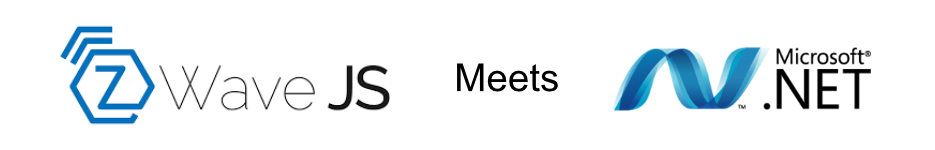

  

# ZWaveJS.NET


[](https://deepscan.io/dashboard#view=project&tid=17652&pid=21245&bid=606186)


ZWaveJS.NET is a class library developed for the .NET framework family, that opens up the zwave-js Driver in .NET, allowing its full runtime to be used directly in .NET applications.  

## Supported Targets
 - NET 4.8 
 - NET 5.0 
 - NET 6.0 
 - NET 7.0 
 - NET Standard 2.0  
 - NET Standard 2.1  

The library strictly follows the structure of the zwave-js API. 

Examples:  

```c#
Driver.Controller.BeginHealingNetwork()
Driver.Controller.Nodes.Get(4).GetDefinedValueIDs()
Driver.Controller.Nodes.Get(4).SetValue(ValueID ValueID, object Value, SetValueAPIOptions Options = null)
Driver.Controller.Nodes.Get(4).GetEndpoint(2).InvokeCCAPI(int CommandClass, string Method, params object[] Params)
```  

## Features

The library contains all the core features of the ZWave JS API whilst the code base, is structured in such a way, exposing new methods offered by the server can be achived in minutes.   

## Getting Started.

The library can operate in 2 ways: Client or Self Hosted.  

**Client**  
The library will connect to an already running instance of [zwave-js-server](https://github.com/zwave-js/zwave-js-server).  

**Self Hosted**  
The library will host its own zwave-js instance.  
You might ask, if in this mode, **nodejs** and **npm** is needed on the host system - it is not!

This is all possible with an accompanying file - **server.psi**. (Platform Support Image)  

Its an executable that is running silently/hidden,  
and it contains everything necessary for .NET to work with zwave-js.  

**server.psi** files are platform specific, but the assembly isn't - it will run on windows, OSX and Linux, and the platform specifics i.e **node** are contained in **server.psi**.

## Prebuilt PSI's
 - Windows x64
 - MacOS x64 (Should support Apple Silicon via Rosetta 2)
 - Ubuntu Linux x64
 - Debian ARM64

## Building yor own platform specific binary.

To build an image for your platform:
 - Clone the repo
 - cd to **./PSI**
 - run `npm install`
 - and finally `npm run build`
 - rename **dist/server** to **server.psi**, and distrubute with your application/dll.

Every release will include a set of PSI images, so download the one for your platform, and rename it to **server.psi**, and ensure its in the same location as the dll.

There is also a Helper method that pulls down the correct image if one is needed **ZWaveJS.NET.Helpers.DownloadPSI()**  

**server.psi** is not needed, if using the library in Client Mode.

The class library contains most of the methods you will need, from including a secure device, to removing it.

## Installing.

All releases will be published to nuget, so search for **ZWaveJS.NET** and install it, the **nupkg** file will also be attached to the release here, on Github, along with the platform PSI files.

## Brief Example
```c#
static ZWaveJS.NET.Driver _Driver;
static void Main(string[] args)
{
    // Set S0, S2 encryption keys, enable logging, adjust network timeouts so on and so forth.
     ZWaveJS.NET.ZWaveOptions Options = new  ZWaveJS.NET.ZWaveOptions();

    // Create Driver Instance
    _Driver = new Driver("COM7", Options);

    // Subscribe to driver ready
    _Driver.DriverReady += _Driver_DriverReady;
   
    _Driver.Start();
}

private static void _Driver_DriverReady()
{
    // Update a value
    ZWaveJS.NET.ValueID VID = new ZWaveJS.NET.ValueID();
    VID.commandClass = 135;
    VID.property = "value";
    VID.endpoint = 0;

    // Support for set Value Options
    ZWaveJS.NET.SetValueAPIOptions SVO = new  ZWaveJS.NET.SetValueAPIOptions();
    SVO.transitionDuration = "2s";
    SVO.volume = 30;

    // All methods return a task, as to not block the UI
    _Driver.Controller.Nodes.Get(4).SetValue(VID, 200, SVO).ContinueWith((res) => {
        if (res.Result.Success) {
            Console.WriteLine("Value Updated");
        }
    });

    // Subscribe to value updates on a node
    _Driver.Controller.Nodes.Get(3).ValueUpdated += Program_ValueUpdated;

    // Or All of them
    ZWaveJS.NET.ZWaveNode[] Nodes = _Driver.Controller.Nodes.AsArray();
    foreach(ZWaveJS.NET.ZWaveNode Node in Nodes)
    {
        Node.ValueUpdated += Program_ValueUpdated;
    }

     // Other Node methods
    _Driver.Controller.Nodes.Get(4).GetDefinedValueIDs().ContinueWith((res) => {
        if(res.Result.Success){
            // Do something with Value ID's (res.Result.ResultPayload)
        } else {
            // See res.Result.Message and res.Result.ErrorCode
        }
    });

    // Subscribe to new nodes being added to the network
    _Driver.Controller.NodeAdded += Controller_NodeAdded;

   
}

private static void Program_ValueUpdated(ZWaveNode Node, ValueUpdatedArgs Args)
{
   // Do something with Args
}

private void Controller_NodeAdded(ZWaveNode Node, InclusionResultArgs Args)
{
    // Add the new node to the UI
}
```

## License 

MIT License

Copyright (c) 2021 Marcus Davies

Permission is hereby granted, free of charge, to any person obtaining a copy
of this software and associated documentation files (the "Software"), to deal
in the Software without restriction, including without limitation the rights
to use, copy, modify, merge, publish, distribute, sublicense, and/or sell
copies of the Software, and to permit persons to whom the Software is
furnished to do so, subject to the following conditions:

The above copyright notice and this permission notice shall be included in all
copies or substantial portions of the Software.

THE SOFTWARE IS PROVIDED "AS IS", WITHOUT WARRANTY OF ANY KIND, EXPRESS OR
IMPLIED, INCLUDING BUT NOT LIMITED TO THE WARRANTIES OF MERCHANTABILITY,
FITNESS FOR A PARTICULAR PURPOSE AND NONINFRINGEMENT. IN NO EVENT SHALL THE
AUTHORS OR COPYRIGHT HOLDERS BE LIABLE FOR ANY CLAIM, DAMAGES OR OTHER
LIABILITY, WHETHER IN AN ACTION OF CONTRACT, TORT OR OTHERWISE, ARISING FROM,
OUT OF OR IN CONNECTION WITH THE SOFTWARE OR THE USE OR OTHER DEALINGS IN THE
SOFTWARE.
